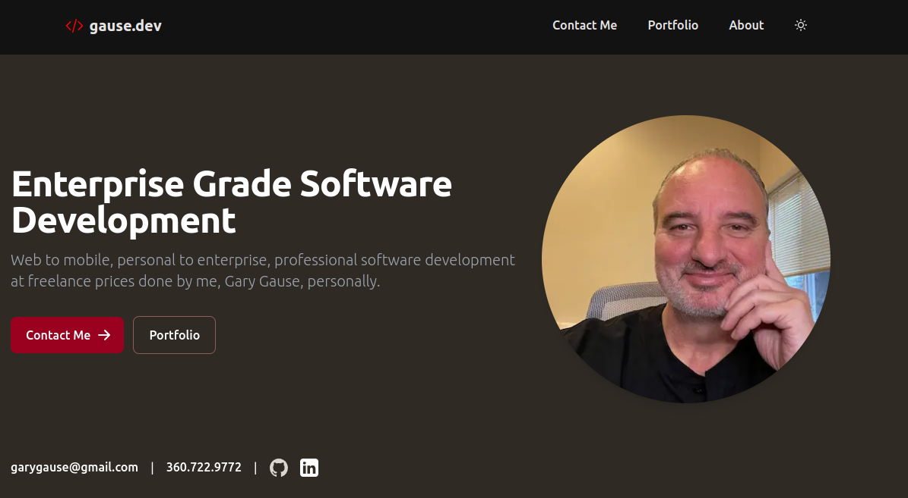

# gause.dev

This is the code for my portfolio website located at [gause.dev](https://gause.dev). Because it is part of my portfoio as well as my personal website, it is written using the Nextjs framework.

# Stack

Nextjs 14, App Routing, MDX, Javascript, Typescript, Tailwind CSS, MongoDB

# Usage

1. Clone the repository:

```bash
git clone git@github.com:garygause/gause.dev.git
```

or

```bash
git clone https://github.com/garygause/gause.dev.git
```

2. Install dependencies:

```bash
npm install
```

3. Run the server:

```bash
npm run dev
```

## Screenshots


